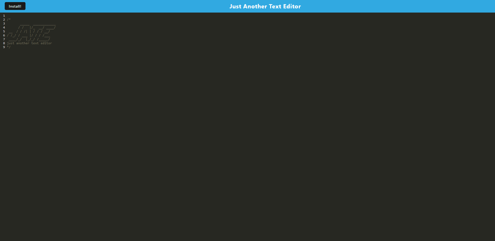

# JATE

## Description

TJATE text editor application created using JavaScript, HTML, and CSS, with the added functionality of utilizing IndexedDB for storing and retrieving text documents. The text editor will feature a user-friendly interface with options for basic text formatting, file management, autosave, undo/redo, and a search function. IndexedDB integration will enable efficient storage and retrieval of documents within the user's browser, enhancing the overall usability and convenience of the editor. The project aims to deliver a versatile and functional text editor that empowers users to create, edit, and manage their text documents seamlessly within a web browser environment.

## Table of contents

- [Installation](#installation)
- [Usage](#usage)
- [Screenshots](#screenshots)
- [Contribution](#contribution)
- [Questions](#questions)
- [License](#license)

## Installation

Clone GitHub repository [JATE](https://github.com/AleksandrBausher/jate)
Run the command

```
npm i
```

and then

```
npm run build
```

and then

```
npm run start
```

## Usage

Click here to access the deployed app [JATE](https://jate-by-aleks.herokuapp.com/)

## Screenshots



## Contribution

Application was created by Aleksandr Bausher and if you want to contribute send me email.

## Questions

My Email:
[aleksandrbausher@gmail.com](mailto:aleksandrbausher@gmail.com)
My Github:
[AleksandrBausher](https://github.com/aleksandrbausher)

## License


